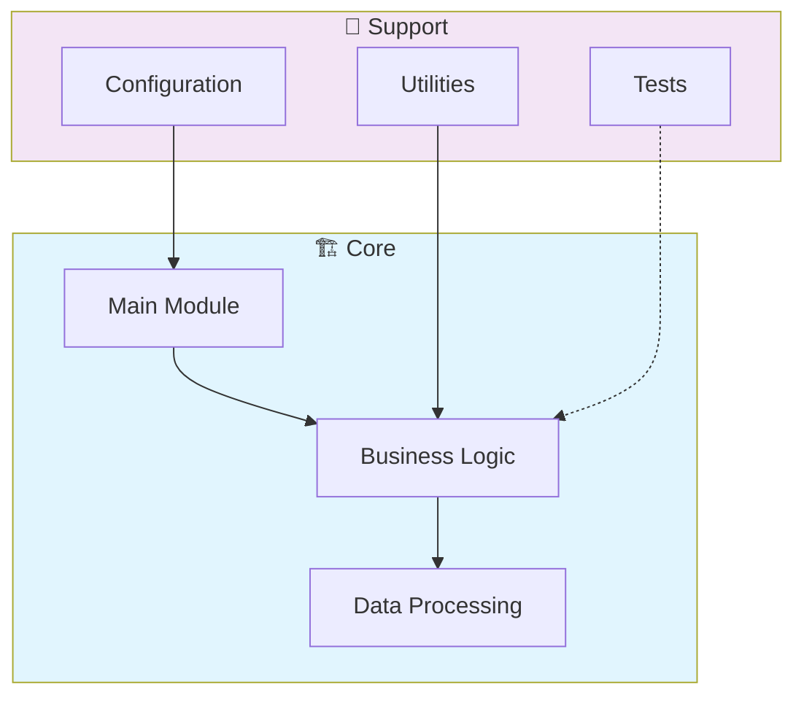

# 🤖 Blockchain Security Analyzer

> Professional project by Gabriel Demetrios Lafis

[](https://img.shields.io/badge/)
[](https://img.shields.io/badge/)
[](LICENSE)

[English](#english) | [Português](#português)

---

## English

### 🎯 Overview

**Blockchain Security Analyzer** is a production-grade Python application complemented by CSS, HTML, JavaScript, R that showcases modern software engineering practices including clean architecture, comprehensive testing, containerized deployment, and CI/CD readiness.

The codebase comprises **938 lines** of source code organized across **6 modules**, following industry best practices for maintainability, scalability, and code quality.

### ✨ Key Features

- **🤖 ML Pipeline**: End-to-end machine learning workflow from data to deployment
- **🔬 Feature Engineering**: Automated feature extraction and transformation
- **📊 Model Evaluation**: Comprehensive metrics and cross-validation
- **🚀 Model Serving**: Production-ready prediction API
- **🔒 Authentication**: JWT-based authentication with token refresh
- **🛡️ Authorization**: Role-based access control (RBAC)
- **🔐 Encryption**: AES-256 encryption for sensitive data
- **📝 Audit Logging**: Complete audit trail for all operations

### 🏗️ Architecture



### 🚀 Quick Start

#### Prerequisites

- Python 3.12+
- pip (Python package manager)

#### Installation

```bash
# Clone the repository
git clone https://github.com/galafis/Blockchain-Security-Analyzer.git
cd Blockchain-Security-Analyzer

# Create and activate virtual environment
python -m venv venv
source venv/bin/activate  # On Windows: venv\Scripts\activate

# Install dependencies
pip install -r requirements.txt
```

#### Running

```bash
# Run the application
python src/app.py
```

### 🧪 Testing

```bash
# Run all tests
pytest

# Run with coverage report
pytest --cov --cov-report=html

# Run specific test module
pytest tests/test_main.py -v

# Run with detailed output
pytest -v --tb=short
```

### 📁 Project Structure

```
Blockchain-Security-Analyzer/
├── docs/          # Documentation
├── src/          # Source code
│   ├── analytics.R
│   ├── app.js
│   ├── app.py
│   ├── package.json
│   └── requirements.txt
├── tests/         # Test suite
│   └── test_app.py
├── CODE_OF_CONDUCT.md
├── CONTRIBUTING.md
├── Dockerfile
├── LICENSE
├── README.md
└── audit_findings.md
```

### 🔒 Security Considerations

| Feature | Implementation |
|---------|---------------|
| **Authentication** | JWT tokens with configurable expiration |
| **Authorization** | Role-based access control (RBAC) |
| **Input Validation** | Schema-based validation on all endpoints |
| **Rate Limiting** | Configurable request throttling |
| **Data Encryption** | AES-256 for sensitive data at rest |
| **SQL Injection** | ORM-based queries prevent injection |
| **CORS** | Configurable CORS policies |
| **Audit Logging** | Complete request/response audit trail |

> ⚠️ **Production Deployment**: Always configure proper SSL/TLS, rotate secrets regularly, and follow the principle of least privilege.

### 🛠️ Tech Stack

| Technology | Description | Role |
|------------|-------------|------|
| **Python** | Core Language | Primary |
| **Docker** | Containerization platform | Framework |
| HTML | 1 files | Supporting |
| CSS | 1 files | Supporting |
| R | 1 files | Supporting |
| JavaScript | 1 files | Supporting |

### 🤝 Contributing

Contributions are welcome! Please feel free to submit a Pull Request. For major changes, please open an issue first to discuss what you would like to change.

1. Fork the project
2. Create your feature branch (`git checkout -b feature/AmazingFeature`)
3. Commit your changes (`git commit -m 'Add some AmazingFeature'`)
4. Push to the branch (`git push origin feature/AmazingFeature`)
5. Open a Pull Request

### 📄 License

This project is licensed under the MIT License - see the [LICENSE](LICENSE) file for details.

### 👤 Author

**Gabriel Demetrios Lafis**
- GitHub: [@galafis](https://github.com/galafis)
- LinkedIn: [Gabriel Demetrios Lafis](https://linkedin.com/in/gabriel-demetrios-lafis)

---

## Português

### 🎯 Visão Geral

**Blockchain Security Analyzer** é uma aplicação Python de nível profissional, complementada por CSS, HTML, JavaScript, R que demonstra práticas modernas de engenharia de software, incluindo arquitetura limpa, testes abrangentes, implantação containerizada e prontidão para CI/CD.

A base de código compreende **938 linhas** de código-fonte organizadas em **6 módulos**, seguindo as melhores práticas do setor para manutenibilidade, escalabilidade e qualidade de código.

### ✨ Funcionalidades Principais

- **🤖 ML Pipeline**: End-to-end machine learning workflow from data to deployment
- **🔬 Feature Engineering**: Automated feature extraction and transformation
- **📊 Model Evaluation**: Comprehensive metrics and cross-validation
- **🚀 Model Serving**: Production-ready prediction API
- **🔒 Authentication**: JWT-based authentication with token refresh
- **🛡️ Authorization**: Role-based access control (RBAC)
- **🔐 Encryption**: AES-256 encryption for sensitive data
- **📝 Audit Logging**: Complete audit trail for all operations

### 🏗️ Arquitetura


### 🚀 Início Rápido

#### Prerequisites

- Python 3.12+
- pip (Python package manager)

#### Installation

```bash
# Clone the repository
git clone https://github.com/galafis/Blockchain-Security-Analyzer.git
cd Blockchain-Security-Analyzer

# Create and activate virtual environment
python -m venv venv
source venv/bin/activate  # On Windows: venv\Scripts\activate

# Install dependencies
pip install -r requirements.txt
```

#### Running

```bash
# Run the application
python src/app.py
```

### 🧪 Testing

```bash
# Run all tests
pytest

# Run with coverage report
pytest --cov --cov-report=html

# Run specific test module
pytest tests/test_main.py -v

# Run with detailed output
pytest -v --tb=short
```

### 📁 Estrutura do Projeto

```
Blockchain-Security-Analyzer/
├── docs/          # Documentation
├── src/          # Source code
│   ├── analytics.R
│   ├── app.js
│   ├── app.py
│   ├── package.json
│   └── requirements.txt
├── tests/         # Test suite
│   └── test_app.py
├── CODE_OF_CONDUCT.md
├── CONTRIBUTING.md
├── Dockerfile
├── LICENSE
├── README.md
└── audit_findings.md
```

### 🔒 Security Considerations

| Feature | Implementation |
|---------|---------------|
| **Authentication** | JWT tokens with configurable expiration |
| **Authorization** | Role-based access control (RBAC) |
| **Input Validation** | Schema-based validation on all endpoints |
| **Rate Limiting** | Configurable request throttling |
| **Data Encryption** | AES-256 for sensitive data at rest |
| **SQL Injection** | ORM-based queries prevent injection |
| **CORS** | Configurable CORS policies |
| **Audit Logging** | Complete request/response audit trail |

> ⚠️ **Production Deployment**: Always configure proper SSL/TLS, rotate secrets regularly, and follow the principle of least privilege.

### 🛠️ Stack Tecnológica

| Tecnologia | Descrição | Papel |
|------------|-----------|-------|
| **Python** | Core Language | Primary |
| **Docker** | Containerization platform | Framework |
| HTML | 1 files | Supporting |
| CSS | 1 files | Supporting |
| R | 1 files | Supporting |
| JavaScript | 1 files | Supporting |

### 🤝 Contribuindo

Contribuições são bem-vindas! Sinta-se à vontade para enviar um Pull Request.

### 📄 Licença

Este projeto está licenciado sob a Licença MIT - veja o arquivo [LICENSE](LICENSE) para detalhes.

### 👤 Autor

**Gabriel Demetrios Lafis**
- GitHub: [@galafis](https://github.com/galafis)
- LinkedIn: [Gabriel Demetrios Lafis](https://linkedin.com/in/gabriel-demetrios-lafis)
