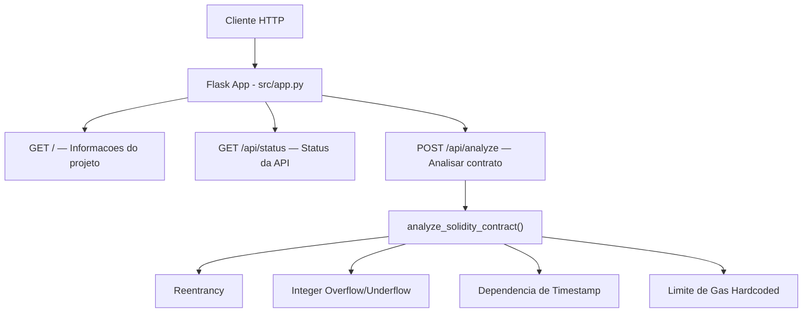
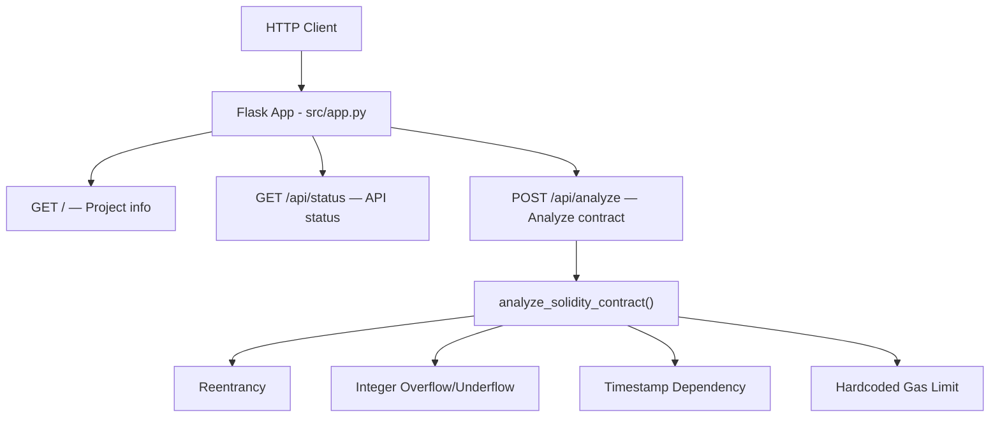

# Blockchain-Security-Analyzer

Analisador de seguranca de contratos inteligentes Solidity usando deteccao de padroes via regex. API Flask com 4 verificacoes de vulnerabilidade.

Solidity smart contract security analyzer using regex-based pattern detection. Flask API with 4 vulnerability checks.

---

[Portugues](#portugues) | [English](#english)

---

## Portugues

### Descricao

Aplicacao Flask simples (~90 linhas de Python, 1 modulo) que analisa codigo-fonte de contratos inteligentes Solidity em busca de padroes de vulnerabilidade usando expressoes regulares. Nao utiliza machine learning, IA, banco de dados, autenticacao, criptografia ou containerizacao.

### O que faz

- API Flask com 3 rotas
- Analise estatica baseada em regex para contratos Solidity
- Detecta 4 padroes de vulnerabilidade:
  - **Reentrancy** (uso de call/send/transfer com value)
  - **Integer Overflow/Underflow** (operacoes aritmeticas em tipos uint/int sem SafeMath)
  - **Dependencia de Timestamp** (uso de block.timestamp)
  - **Limite de Gas Hardcoded** (gas limits fixos no codigo)

### O que NAO possui

- Machine Learning / IA
- Autenticacao (JWT ou outra)
- Controle de acesso (RBAC)
- Criptografia (AES-256 ou outra)
- Audit logging
- Rate limiting
- CORS
- ORM / Banco de dados
- Containerizacao (Docker)

### Arquitetura



### Inicio rapido

```bash
git clone https://github.com/galafis/Blockchain-Security-Analyzer.git
cd Blockchain-Security-Analyzer
python -m venv venv
source venv/bin/activate  # Windows: venv\Scripts\activate
pip install -r requirements.txt
python src/app.py
```

### Endpoints da API

| Metodo | Rota | Descricao |
|--------|------|-----------|
| GET | `/` | Informacoes gerais do projeto |
| GET | `/api/status` | Status da API |
| POST | `/api/analyze` | Analisa contrato Solidity (enviar `{"code": "..."}` no corpo) |

### Exemplo de uso

```bash
curl -X POST http://localhost:5000/api/analyze \
  -H "Content-Type: application/json" \
  -d '{"code": "function withdraw() public { msg.sender.call{value: balance}(\"\"); }"}'
```

### Testes

6 testes unitarios legitimos cobrindo todas as rotas e detectores de vulnerabilidade:

```bash
python -m pytest tests/test_app.py -v
```

### Stack tecnologica

| Tecnologia | Papel |
|------------|-------|
| Python | Linguagem principal |
| Flask | Framework web (API) |

---

## English

### Description

Simple Flask application (~90 lines of Python, 1 module) that analyzes Solidity smart contract source code for vulnerability patterns using regular expressions. No machine learning, AI, database, authentication, encryption, or containerization.

### What it does

- Flask API with 3 routes
- Regex-based static analysis for Solidity contracts
- Detects 4 vulnerability patterns:
  - **Reentrancy** (call/send/transfer with value)
  - **Integer Overflow/Underflow** (arithmetic on uint/int types without SafeMath)
  - **Timestamp Dependency** (block.timestamp usage)
  - **Hardcoded Gas Limit** (fixed gas limits in code)

### What it does NOT have

- Machine Learning / AI
- Authentication (JWT or otherwise)
- Access control (RBAC)
- Encryption (AES-256 or otherwise)
- Audit logging
- Rate limiting
- CORS
- ORM / Database
- Containerization (Docker)

### Architecture



### Quick start

```bash
git clone https://github.com/galafis/Blockchain-Security-Analyzer.git
cd Blockchain-Security-Analyzer
python -m venv venv
source venv/bin/activate  # Windows: venv\Scripts\activate
pip install -r requirements.txt
python src/app.py
```

### API Endpoints

| Method | Route | Description |
|--------|-------|-------------|
| GET | `/` | Project information |
| GET | `/api/status` | API status |
| POST | `/api/analyze` | Analyze Solidity contract (send `{"code": "..."}` in body) |

### Usage example

```bash
curl -X POST http://localhost:5000/api/analyze \
  -H "Content-Type: application/json" \
  -d '{"code": "function withdraw() public { msg.sender.call{value: balance}(\"\"); }"}'
```

### Tests

6 legitimate unit tests covering all routes and vulnerability detectors:

```bash
python -m pytest tests/test_app.py -v
```

### Tech stack

| Technology | Role |
|------------|------|
| Python | Primary language |
| Flask | Web framework (API) |

---

## License

MIT - see [LICENSE](LICENSE).

## Author

**Gabriel Demetrios Lafis**
- GitHub: [@galafis](https://github.com/galafis)
- LinkedIn: [Gabriel Demetrios Lafis](https://linkedin.com/in/gabriel-demetrios-lafis)
