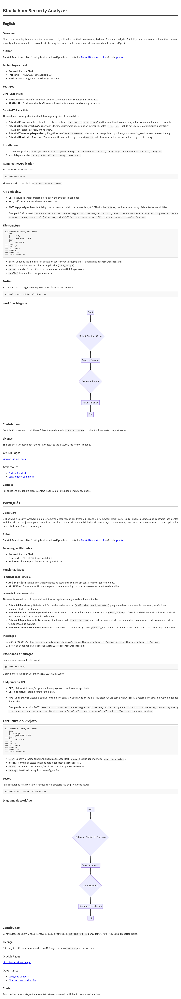
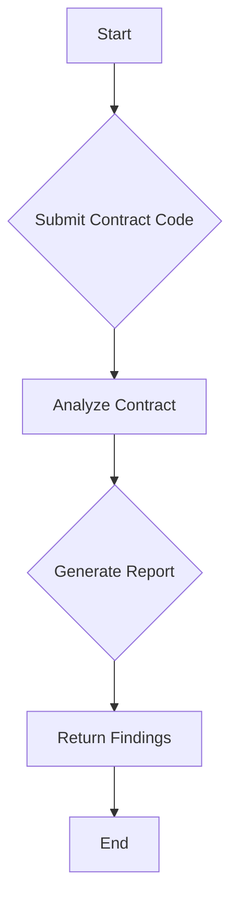
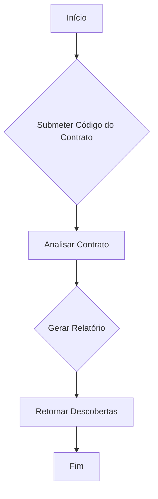

# Blockchain Security Analyzer


## English

### Overview
Blockchain Security Analyzer is a Python-based tool, built with the Flask framework, designed for static analysis of Solidity smart contracts. It identifies common security vulnerability patterns in contracts, helping developers build more secure decentralized applications (dApps).

### Author
**Gabriel Demetrios Lafis**
- Email: gabrieldemetrios@gmail.com
- LinkedIn: [Gabriel Demetrios Lafis](https://www.linkedin.com/in/gabriel-demetrios-lafis-62197711b)
- GitHub: [galafis](https://github.com/galafis)

### Technologies Used
- **Backend**: Python, Flask
- **Frontend**: HTML5, CSS3, JavaScript (ES6+)
- **Static Analysis**: Regular Expressions (re module)

### Features

#### Core Functionality
- **Static Analysis**: Identifies common security vulnerabilities in Solidity smart contracts.
- **RESTful API**: Provides a simple API to submit contract code and receive analysis reports.

#### Detected Vulnerabilities
The analyzer currently identifies the following categories of vulnerabilities:

*   **Potential Reentrancy**: Detects patterns of external calls (`call.value`, `send`, `transfer`) that could lead to reentrancy attacks if not implemented correctly.
*   **Potential Integer Overflow/Underflow**: Identifies arithmetic operations on integer variables (`uint`, `int`) that do not use SafeMath libraries, potentially resulting in integer overflow or underflow.
*   **Potential Timestamp Dependency**: Flags the use of `block.timestamp`, which can be manipulated by miners, compromising randomness or event timing.
*   **Potential Hardcoded Gas Limit**: Warns about the use of fixed gas limits (`gas: X`), which can cause transaction failures if gas costs change.

### Installation

1.  Clone the repository:
    ```bash
    git clone https://github.com/galafis/Blockchain-Security-Analyzer.git
    cd Blockchain-Security-Analyzer
    ```
2.  Install dependencies:
    ```bash
    pip install -r src/requirements.txt
    ```

### Running the Application

To start the Flask server, run:

```bash
python3 src/app.py
```

The server will be available at `http://127.0.0.1:5000/`.

### API Endpoints

*   **GET /**: Returns general project information and available endpoints.
*   **GET /api/status**: Returns the current API status.
*   **POST /api/analyze**: Accepts Solidity contract source code in the request body (JSON with the `code` key) and returns an array of detected vulnerabilities.

    Example POST request:
    ```bash
    curl -X POST -H "Content-Type: application/json" -d \
    '{"code": "function vulnerable() public payable { (bool success, ) = msg.sender.call{value: msg.value}(\"\"); require(success); }"}' \
    http://127.0.0.1:5000/api/analyze
    ```

### File Structure

```
Blockchain-Security-Analyzer/
├── src/
│   ├── app.py
│   └── requirements.txt
├── tests/
│   └── test_app.py
├── docs/
├── config/
├── .gitignore
├── LICENSE
├── README.md
└── CONTRIBUTING.md
```

*   `src/`: Contains the main Flask application source code (`app.py`) and its dependencies (`requirements.txt`).
*   `tests/`: Contains unit tests for the application (`test_app.py`).
*   `docs/`: Intended for additional documentation and GitHub Pages assets.
*   `config/`: Intended for configuration files.

### Testing

To run unit tests, navigate to the project root directory and execute:

```bash
python3 -m unittest tests/test_app.py
```

### Workflow Diagram





### Contribution
Contributions are welcome! Please follow the guidelines in `CONTRIBUTING.md` to submit pull requests or report issues.

### License
This project is licensed under the MIT License. See the `LICENSE` file for more details.

### GitHub Pages
[View on GitHub Pages](https://galafis.github.io/Blockchain-Security-Analyzer/)

### Governance
- [Code of Conduct](CODE_OF_CONDUCT.md)
- [Contribution Guidelines](CONTRIBUTING.md)

### Contact
For questions or support, please contact via the email or LinkedIn mentioned above.

---

## Português

### Visão Geral
O Blockchain Security Analyzer é uma ferramenta desenvolvida em Python, utilizando o framework Flask, para realizar análises estáticas de contratos inteligentes Solidity. Ele foi projetado para identificar padrões comuns de vulnerabilidades de segurança em contratos, ajudando desenvolvedores a criar aplicações descentralizadas (dApps) mais seguras.

### Autor
**Gabriel Demetrios Lafis**
- Email: gabrieldemetrios@gmail.com
- LinkedIn: [Gabriel Demetrios Lafis](https://www.linkedin.com/in/gabriel-demetrios-lafis-62197711b)
- GitHub: [galafis](https://github.com/galafis)

### Tecnologias Utilizadas
- **Backend**: Python, Flask
- **Frontend**: HTML5, CSS3, JavaScript (ES6+)
- **Análise Estática**: Expressões Regulares (módulo re)

### Funcionalidades

#### Funcionalidade Principal
- **Análise Estática**: Identifica vulnerabilidades de segurança comuns em contratos inteligentes Solidity.
- **API RESTful**: Fornece uma API simples para submeter o código do contrato e receber relatórios de análise.

#### Vulnerabilidades Detectadas
Atualmente, o analisador é capaz de identificar as seguintes categorias de vulnerabilidades:

*   **Potencial Reentrancy**: Detecta padrões de chamadas externas (`call.value`, `send`, `transfer`) que podem levar a ataques de reentrancy se não forem implementados corretamente.
*   **Potencial Integer Overflow/Underflow**: Identifica operações aritméticas em variáveis inteiras (`uint`, `int`) que não utilizam bibliotecas de SafeMath, podendo resultar em overflow ou underflow de inteiros.
*   **Potencial Dependência de Timestamp**: Sinaliza o uso de `block.timestamp`, que pode ser manipulado por mineradores, comprometendo a aleatoriedade ou a temporização de eventos.
*   **Potencial Limite de Gás Hardcoded**: Alerta sobre o uso de limites de gás fixos (`gas: X`), que podem causar falhas em transações se os custos de gás mudarem.

### Instalação

1.  Clone o repositório:
    ```bash
    git clone https://github.com/galafis/Blockchain-Security-Analyzer.git
    cd Blockchain-Security-Analyzer
    ```
2.  Instale as dependências:
    ```bash
    pip install -r src/requirements.txt
    ```

### Executando a Aplicação

Para iniciar o servidor Flask, execute:

```bash
python3 src/app.py
```

O servidor estará disponível em `http://127.0.0.1:5000/`.

### Endpoints da API

*   **GET /**: Retorna informações gerais sobre o projeto e os endpoints disponíveis.
*   **GET /api/status**: Retorna o status atual da API.
*   **POST /api/analyze**: Aceita o código-fonte de um contrato Solidity no corpo da requisição (JSON com a chave `code`) e retorna um array de vulnerabilidades detectadas.

    Exemplo de requisição POST:
    ```bash
    curl -X POST -H "Content-Type: application/json" -d \
    '{"code": "function vulnerable() public payable { (bool success, ) = msg.sender.call{value: msg.value}(\"\"); require(success); }"}' \
    http://127.0.0.1:5000/api/analyze
    ```

## Estrutura do Projeto

```
Blockchain-Security-Analyzer/
├── src/
│   ├── app.py
│   └── requirements.txt
├── tests/
│   └── test_app.py
├── docs/
├── config/
├── .gitignore
├── LICENSE
├── README.md
└── CONTRIBUTING.md
```

*   `src/`: Contém o código-fonte principal da aplicação Flask (`app.py`) e suas dependências (`requirements.txt`).
*   `tests/`: Contém os testes unitários para a aplicação (`test_app.py`).
*   `docs/`: Destinado a documentação adicional e ativos para GitHub Pages.
*   `config/`: Destinado a arquivos de configuração.

### Testes

Para executar os testes unitários, navegue até o diretório raiz do projeto e execute:

```bash
python3 -m unittest tests/test_app.py
```

### Diagrama de Workflow




### Contribuição
Contribuições são bem-vindas! Por favor, siga as diretrizes em `CONTRIBUTING.md` para submeter pull requests ou reportar issues.

### Licença
Este projeto está licenciado sob a licença MIT. Veja o arquivo `LICENSE` para mais detalhes.

### GitHub Pages
[Visualizar no GitHub Pages](https://galafis.github.io/Blockchain-Security-Analyzer/)

### Governança
- [Código de Conduta](CODE_OF_CONDUCT.md)
- [Diretrizes de Contribuição](CONTRIBUTING.md)

### Contato
Para dúvidas ou suporte, entre em contato através do email ou LinkedIn mencionados acima.

