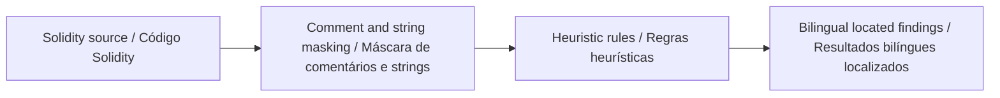

# Solidity Source Review

### Revisão de Código Solidity

[](https://github.com/galafis/Blockchain-Security-Analyzer/actions/workflows/ci.yml)
[English](#english) · [Português](#portugues) · [Examples / Exemplos](examples/review_demo.py) · [Validation / Validação](docs/VALIDATION.md)

**Application security / Segurança de aplicações** · Working prototype / Protótipo funcional · Gabriel Demetrios Lafis

<a id="english"></a>

## English

A lightweight source scanner that identifies review points in Solidity code and returns bilingual explanations with exact source locations.

### What works

- Masks comments and string literals while preserving character offsets and line breaks.
- Reports each matched occurrence with rule ID, line, column and source evidence.
- Offers a Flask JSON endpoint with source-type and size validation.

### Reproducible walkthrough

Requirements: Python 3.12 / Python 3.12.

Run from the repository root. The validation environment installs the components exercised by the tests and documented example; optional integrations may need their separate dependencies.

```sh
python -m venv .venv
# Activate .venv for your shell / Ative .venv no seu terminal
python -m pip install -r requirements-validation.txt
python -m pytest -q
python -m examples.review_demo
```

**Input contract / Contrato de entrada:** POST `/api/analyze` with / com `{ "code": "..." }`; 1–100000 source characters / caracteres.

**Expected behavior / Comportamento esperado:** The synthetic Solidity example returns arithmetic and timestamp review points; each span maps back to the input source. / O exemplo Solidity fictício devolve pontos de revisão aritmética e temporal; cada intervalo corresponde ao código de entrada.

### Architecture / Arquitetura


```mermaid
flowchart LR
    A["Solidity source / Código Solidity"]
    B["Comment and string masking / Máscara de comentários e strings"]
    C["Heuristic rules / Regras heurísticas"]
    D["Bilingual located findings / Resultados bilíngues localizados"]
    A --> B --> C --> D
```

The main path can be followed in [src/app.py](src/app.py). Examples call the actual implementation and include assertions; they are not pseudocode.

### Scope and assumptions

Findings are review prompts, not confirmed vulnerabilities. No match does not establish safety. This scanner does not compile Solidity, resolve inheritance, inspect bytecode or prove exploitability. The legacy vulnerability field is retained for API compatibility; classification is review_required.

### Changes verified in this review

Reduced comment/string false positives, added occurrence-level evidence and explained arithmetic in its compiler context instead of treating absence of SafeMath as proof.

<a id="portugues"></a>

## Português

Analisador leve que identifica pontos de revisão em código Solidity e devolve explicações bilíngues com localização exata no arquivo.

### Funcionalidades disponíveis

- Mascara comentários e strings preservando offsets de caracteres e quebras de linha.
- Relata cada ocorrência com identificador de regra, linha, coluna e trecho de origem.
- Oferece endpoint JSON Flask com validação do tipo e tamanho do código recebido.

### Execução reproduzível

Use os comandos da seção acima a partir da raiz do repositório. Requisitos: Python 3.12 / Python 3.12. O ambiente de validação instala os componentes exercitados pelos testes e pelo exemplo documentado; integrações opcionais podem exigir dependências próprias.

O fluxo principal está em [src/app.py](src/app.py). Os exemplos usam a implementação real e verificam resultados com asserções; não são pseudocódigo. O diagrama apresenta os mesmos passos nos dois idiomas.

### Escopo e premissas

Resultados orientam revisão e não são vulnerabilidades confirmadas. Ausência de correspondências não comprova segurança. O analisador não compila Solidity, resolve herança, inspeciona bytecode ou prova exploração. O campo legado vulnerability foi preservado por compatibilidade; classification indica review_required.

### Melhorias verificadas nesta revisão

Reduzidos falsos positivos em comentários e strings, adicionada evidência por ocorrência e explicada aritmética no contexto do compilador, sem tratar ausência de SafeMath como prova.

### Run the application / Executar a aplicação

```sh
python -m src.app
```

## Repository guide / Guia do repositório

| Location / Local                                            | Purpose / Finalidade                                                   |
| ----------------------------------------------------------- | ---------------------------------------------------------------------- |
| [Implementation / Implementação](src/app.py)                | Main domain behavior / Comportamento principal do domínio              |
| [Example / Exemplo](examples/review_demo.py)                | Executable scenario / Cenário executável                               |
| [Tests / Testes](tests/)                                    | Normal behavior and failure cases / Fluxos válidos e casos de falha    |
| [Validation notes / Notas de validação](docs/VALIDATION.md) | Corrections, evidence and boundaries / Correções, evidências e limites |
| [Workflow / Automação](.github/workflows/ci.yml)            | Automated checks / Verificações automatizadas                          |

- [Executed example result / Resultado executado do exemplo](examples/expected.json)

## Development / Desenvolvimento

EN: When changing behavior, update the contract, the worked example and a regression test together. Keep synthetic fixtures separate from real data. A passing test suite demonstrates the listed software behaviors; it does not certify a deployment or domain outcome.

PT: Ao alterar comportamento, atualize em conjunto o contrato, o exemplo e um teste de regressão. Separe amostras fictícias de dados reais. Testes aprovados demonstram os comportamentos de software listados; não certificam implantação nem resultado no domínio.

Author / Autor: [Gabriel Demetrios Lafis](https://github.com/galafis) · [Institutional contact / Contato institucional](mailto:gabrieldemetrioslafis@usp.br)

License / Licença: [repository license](LICENSE).

Reference / Referência: [Solidity control structures and checked arithmetic](https://docs.soliditylang.org/en/latest/control-structures.html#checked-or-unchecked-arithmetic).
